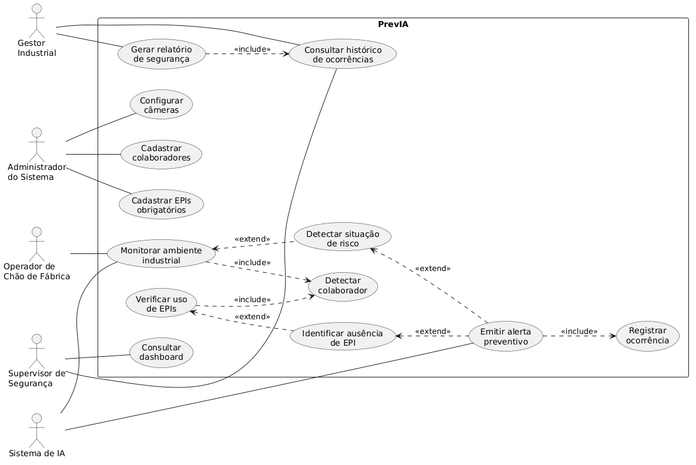
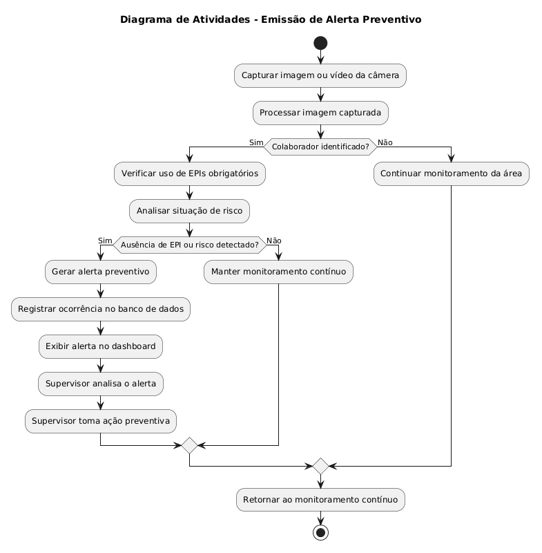
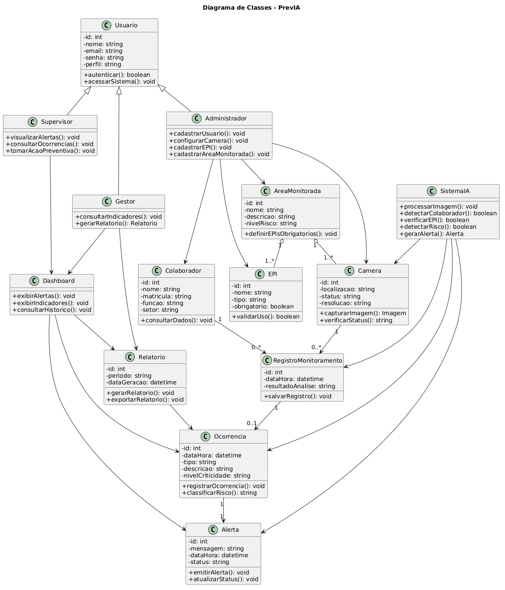

# PrevIA  
## Inteligência que antecipa riscos e protege vidas

---

## Integrantes

- Agatha Cassari Benedicto — RM 556251  
- Gustavo Shinn Shyong Cheng — RM 559084  
- Leonardo Fernandes Veleiro — RM 557773  
- Sara Barbosa da Silva — RM 559042  

---

## Desafio

Desenvolver um sistema inteligente para o monitoramento de segurança proativa do trabalho em ambientes industriais.

O projeto está alinhado ao contexto do Challenge 2026, com foco na transição de uma segurança reativa e punitiva para uma abordagem proativa, preventiva e baseada em dados.

---

## Problema Abordado

No ambiente industrial, a segurança do trabalho ainda é frequentemente tratada de forma reativa. Muitas empresas dependem de inspeções periódicas, checklists manuais e ações corretivas somente após a ocorrência de acidentes ou infrações.

Esse modelo apresenta diversos problemas, como:

- Identificação tardia de riscos;
- Falta de monitoramento contínuo;
- Dependência excessiva da observação humana;
- Maior chance de falhas operacionais;
- Custos elevados com acidentes, paralisações, multas e afastamentos;
- Cultura punitiva, que pode desestimular o relato de incidentes.

Dessa forma, existe a necessidade de uma solução capaz de identificar riscos em tempo real, apoiar a prevenção de acidentes e fortalecer uma cultura de segurança proativa.

---

## Proposta de Solução

O **PrevIA** é um sistema inteligente de monitoramento industrial em tempo real que utiliza visão computacional e inteligência artificial para identificar situações de risco e verificar o uso correto de Equipamentos de Proteção Individual, os EPIs.

A solução propõe o uso de câmeras posicionadas no ambiente industrial para capturar imagens dos colaboradores em campo. Essas imagens são processadas por algoritmos de visão computacional capazes de detectar pessoas, identificar EPIs obrigatórios e reconhecer possíveis comportamentos de risco.

Quando uma situação irregular é identificada, o sistema emite alertas imediatos para supervisores e registra a ocorrência para consulta posterior, geração de relatórios e acompanhamento de indicadores de segurança.

---

## Objetivo Geral

Desenvolver um sistema inteligente capaz de apoiar a segurança industrial proativa por meio do monitoramento em tempo real, identificação automática de riscos e emissão de alertas preventivos.

---

## Objetivos Específicos

- Detectar colaboradores em ambiente industrial por meio de câmeras;
- Verificar automaticamente o uso correto de EPIs;
- Identificar situações de risco, como ausência de equipamentos obrigatórios ou comportamento inadequado em áreas perigosas;
- Emitir alertas em tempo real para supervisores;
- Registrar ocorrências para análise posterior;
- Gerar dados para relatórios e indicadores de segurança;
- Apoiar a tomada de decisão dos gestores industriais;
- Reduzir a dependência de inspeções manuais e ações apenas corretivas.

---

## Público-Alvo

O sistema PrevIA é voltado para ambientes industriais que necessitam de monitoramento contínuo de segurança.

Os principais usuários da solução são:

- Operadores de chão de fábrica;
- Supervisores de segurança do trabalho;
- Gestores industriais;
- Administradores do sistema.

---

## Funcionamento Geral do Sistema

O funcionamento do PrevIA segue o seguinte fluxo:

1. A câmera captura imagens do ambiente industrial;
2. O sistema identifica a presença de colaboradores;
3. O algoritmo de visão computacional verifica o uso correto dos EPIs;
4. O sistema analisa possíveis situações de risco;
5. Caso uma irregularidade seja detectada, um alerta é gerado;
6. A ocorrência é registrada no banco de dados;
7. Supervisores acompanham os alertas e indicadores por meio de um dashboard;
8. Gestores podem consultar relatórios e históricos de conformidade.

---

## Tecnologias Utilizadas

| Tecnologia | Finalidade |
|-----------|------------|
| Python | Linguagem principal para desenvolvimento da inteligência artificial, visão computacional e backend |
| OpenCV | Captura, leitura e processamento de imagens e vídeos |
| YOLO | Detecção de objetos em tempo real, como pessoas e EPIs |
| MediaPipe Pose ou YOLO Pose | Análise de postura e comportamento de risco |
| FastAPI | Criação da API backend do sistema |
| PostgreSQL | Armazenamento de colaboradores, alertas, ocorrências e relatórios |
| React.js | Desenvolvimento do dashboard web |
| WebSocket | Comunicação em tempo real entre backend e dashboard |
| GitHub | Versionamento, organização e documentação do projeto |
| Draw.io ou PlantUML | Criação dos diagramas UML |

A stack tecnológica apresentada representa uma proposta inicial da equipe e poderá ser ajustada ao longo do desenvolvimento, conforme testes, limitações técnicas e decisões futuras do projeto.

Mais detalhes estão disponíveis em:

[docs/tecnologias.md](docs/tecnologias.md)

---

## Documentação do Projeto

A documentação completa da Sprint 1 está organizada na pasta `docs`.

| Documento | Descrição |
|----------|-----------|
| [Requisitos](docs/requisitos.md) | Requisitos funcionais, não funcionais, regras de negócio e atores do sistema |
| [Tecnologias](docs/tecnologias.md) | Stack tecnológica e justificativa técnica |
| [Personas](docs/personas.md) | Perfis dos usuários envolvidos no sistema |
| [Restrições](docs/restricoes.md) | Limitações, premissas e restrições do projeto |
| [Diagrama de Casos de Uso](docs/diagrama-casos-de-uso.md) | Descrição dos atores, casos de uso e relacionamentos include/extend |
| [Diagrama de Atividades](docs/diagrama-atividades.md) | Fluxo de emissão de alerta preventivo |
| [Diagrama de Classes](docs/diagrama-classes.md) | Estrutura de classes, atributos, métodos e relacionamentos |

---

## Diagramas UML

Os diagramas UML foram desenvolvidos para representar o funcionamento e a estrutura do sistema PrevIA.

### Diagrama de Casos de Uso

Representa os principais atores do sistema, suas interações e os relacionamentos entre os casos de uso.



---

### Diagrama de Atividades

Representa o fluxo principal de monitoramento, análise de risco e emissão de alerta preventivo.



---

### Diagrama de Classes

Representa as principais entidades do sistema, seus atributos, métodos e relacionamentos.



---

## Estrutura do Repositório

```txt
PrevIA/
│
├── README.md
├── entrega.txt
│
├── docs/
│   ├── requisitos.md
│   ├── tecnologias.md
│   ├── personas.md
│   ├── restricoes.md
│   ├── diagrama-casos-de-uso.md
│   ├── diagrama-atividades.md
│   └── diagrama-classes.md
│
└── diagramas/
    ├── caso-de-uso.png
    ├── atividades.png
    └── classes.png
