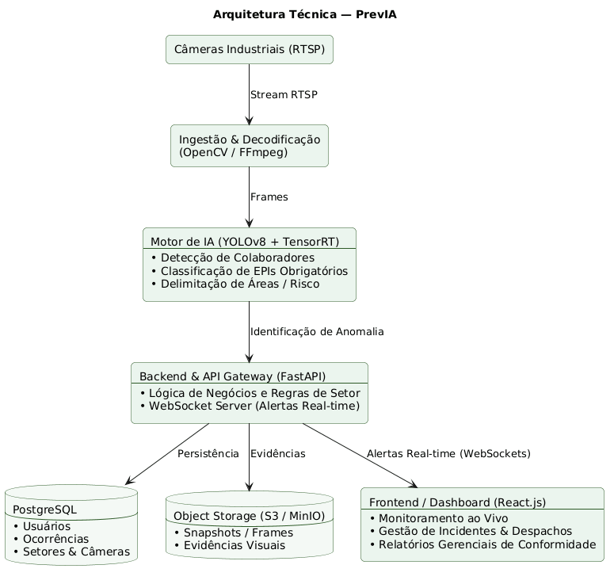

# Arquitetura Técnica — PrevIA

## 1. Objetivo

Este documento descreve a arquitetura técnica refinada do sistema **PrevIA** na Sprint 3, detalhando os componentes de infraestrutura, o pipeline de visão computacional em tempo real e os fluxos de comunicação entre a captura em chão de fábrica e a interface de gestão.

O objetivo é demonstrar como o sistema garante baixa latência na detecção de riscos, alta confiabilidade no processamento e persistência estruturada para apoiar a segurança industrial proativa.

---

## 2. Visão Geral da Arquitetura

O PrevIA foi projetado com uma arquitetura modular orientada a microsserviços e processamento em borda (edge/on-premise), dividida em quatro camadas principais:

| Camada | Tecnologias Principais | Responsabilidade |
|---|---|---|
| **Borda / Ingestão (Edge)** | Câmeras IP (RTSP), OpenCV, FFmpeg | Captura dos fluxos de vídeo no chão de fábrica e decodificação contínua de frames. |
| **Inteligência Artificial** | YOLOv8, TensorRT | Detecção de operadores, classificação de EPIs por zona e análise espacial de risco. |
| **Backend e Mensageria** | FastAPI (Python), WebSockets, Redis Pub/Sub | Regras de negócio, cálculo de conformidade, emissão imediata de alertas e controle de APIs. |
| **Persistência Híbrida** | PostgreSQL, Object Storage (S3/MinIO) | Armazenamento de metadados relacionais e retenção de frames de evidência com anotações visuais. |
| **Apresentação (Frontend)** | React.js, TailwindCSS | Dashboard ao vivo para supervisão, gestão de incidentes, despacho de ações e relatórios gerenciais. |

---

## 3. Descrição dos Componentes e Fluxo de Dados

### 3.1 Ingestão e Processamento de Streams
- As câmeras instaladas nas áreas monitoradas transmitem vídeo contínuo via protocolo **RTSP**.
- O módulo de ingestão baseado em **OpenCV / FFmpeg** consome os pacotes, realiza o descarte programado de quadros redundantes (frame sampling) e encaminha os frames limpos para inferência com consumo controlado de banda e memória.

### 3.2 Pipeline de Inteligência Artificial
- O modelo **YOLOv8** atua com pesos otimizados via **TensorRT** para acelerar a inferência em GPU.
- O pipeline opera em três etapas consecutivas:
  1. Identificação de pessoas em cena;
  2. Extração de regiões de interesse (cabeça, tronco, pés, mãos) para classificação da presença de EPIs;
  3. Checagem contra as regras cadastradas daquela área específica (geofencing e lista de EPIs mandatórios).

### 3.3 Backend, Regras e Notificações em Tempo Real
- Desenvolvido em **FastAPI**, o backend expõe endpoints RESTful para CRUDs operacionais e gerencia canais de **WebSockets**.
- Quando uma violação é confirmada pelo pipeline de IA, a ocorrência é gerada e despachada instantaneamente para os supervisores logados, reduzindo o tempo de resposta a incidentes críticos.

### 3.4 Armazenamento Híbrido
- **PostgreSQL:** Armazena dados estruturados e relacionais (usuários, colaboradores, áreas monitoradas, câmeras, status de validação de ocorrências e logs de auditoria).
- **Object Storage (S3 / MinIO):** Armazena os frames congelados da infração com as caixas delimitadoras (*bounding boxes*) geradas pela IA, servindo como evidência rastreável para a NR-1.

---

## 4. Representação Visual da Arquitetura

