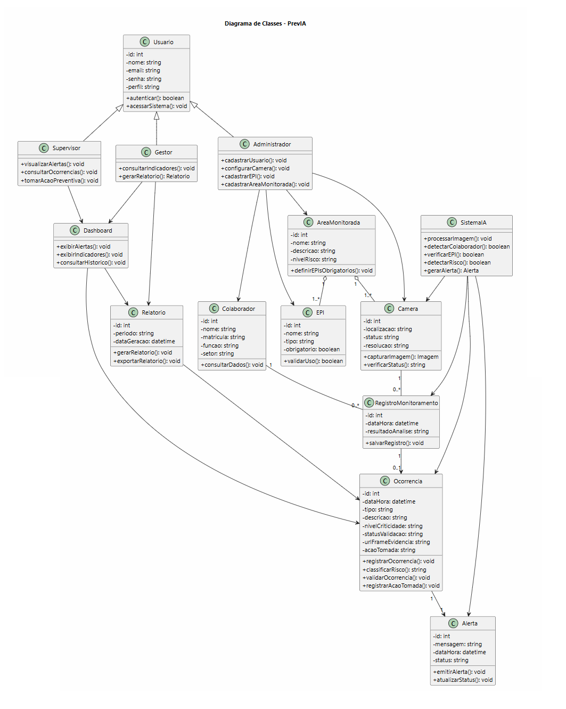

# Diagrama de Classes — PrevIA

## 1. Objetivo

Este documento descreve o Diagrama de Classes do sistema **PrevIA**, apresentando as principais entidades, atributos, métodos e relacionamentos da solução.

O diagrama tem como objetivo representar a estrutura lógica do sistema, servindo como base para o desenvolvimento e evolução técnica da aplicação.

---

## 2. Principais Classes

O sistema PrevIA possui classes relacionadas ao monitoramento industrial, controle de colaboradores, parametrização de regras por área, verificação de EPIs, emissão de alertas, registro e auditoria de ocorrências e geração de relatórios.

As principais classes são:

- Usuario
- Supervisor
- Gestor
- Administrador
- Colaborador
- AreaMonitorada
- Camera
- EPI
- RegistroMonitoramento
- Ocorrencia
- Alerta
- Relatorio
- Dashboard
- SistemaIA

---

## 3. Descrição das Classes

| Classe | Descrição |
|---|---|
| Usuario | Representa um usuário do sistema com acesso ao dashboard ou funções administrativas. |
| Supervisor | Usuário responsável por acompanhar alertas, validar ocorrências e despachar ações preventivas. |
| Gestor | Usuário responsável por consultar relatórios e indicadores. |
| Administrador | Usuário responsável por cadastrar dados, configurar câmeras e parametrizar regras de segurança. |
| Colaborador | Representa o trabalhador monitorado no ambiente industrial. |
| AreaMonitorada | Representa uma zona industrial acompanhada por câmeras e vinculada a uma matriz de EPIs obrigatórios. |
| Camera | Representa o dispositivo responsável por capturar fluxos de imagem e vídeo (RTSP). |
| EPI | Representa os equipamentos de proteção individual exigidos. |
| RegistroMonitoramento | Representa um registro de análise contínua feita pelo sistema. |
| Ocorrencia | Representa uma não conformidade ou situação de risco detectada, contendo status de validação, evidência visual e ação tomada. |
| Alerta | Representa o alerta gerado e despachado em tempo real a partir de uma ocorrência. |
| Relatorio | Representa relatórios consolidados de segurança e conformidade. |
| Dashboard | Representa a interface de acompanhamento e visualização dos dados em tempo real. |
| SistemaIA | Representa o módulo de visão computacional responsável por processar imagens e detectar riscos/EPIs. |

---

## 4. Representação em PlantUML

